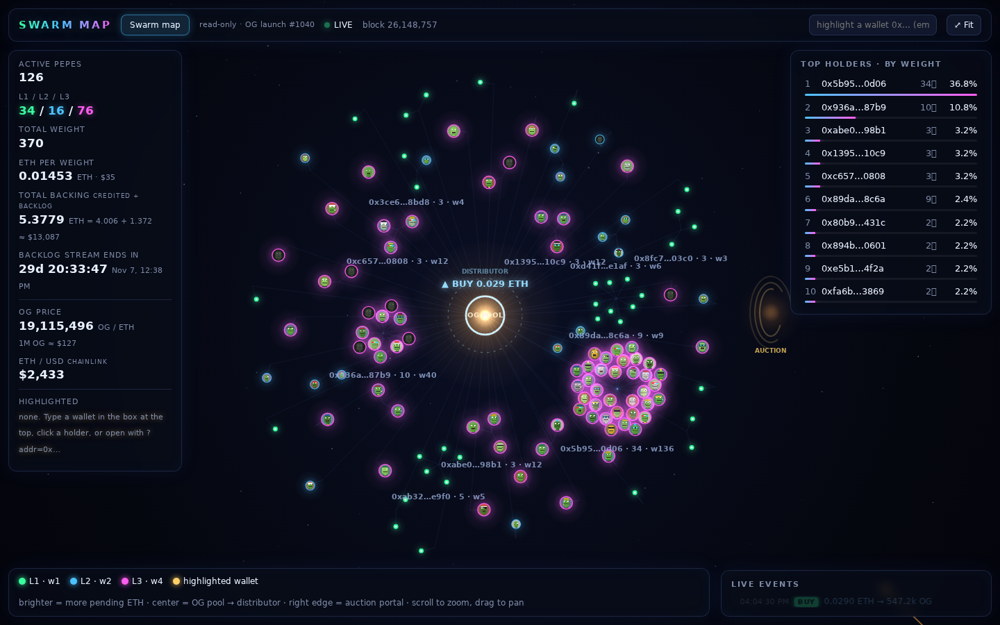

# OG · Swarm map

A live, read-only visualizer for the **OG** token launch (IMD launch #1040) and its **Swarm Pepe** distributor on Ethereum mainnet.

Every active Swarm Pepe is a glowing node, clustered around the wallet that owns it. Each OG trade sends a pulse from the pool core through the distributor out to the Pepes, weighted by how much each one earns.



**No wallet, no keys, no transactions.** The page only reads public chain data through a free public RPC (`eth_call`, `eth_getLogs`, `eth_blockNumber`). It never asks for a wallet connection and never signs anything.

## What you see

- **Nodes = active Pepes.** Colour and size show the level: green **L1** (weight 1), blue **L2** (weight 2), magenta **L3** (weight 4). Brighter nodes have more pending ETH. Each node shows the Pepe's on-chain pixel art, which comes straight from the NFT's `tokenURI`, so nothing is fetched from external image hosts.
- **Clusters = owner wallets**, packed in a golden-angle spiral with the biggest holders closest to the core.
- **Center = OG pool core + distributor ring. Right edge = auction portal.**
- **Live events**, polled about every 12s:
  - **Buy or sell** (v4 PoolManager `Swap` for the OG pool): a pulse from the core, with the ETH amount shown.
  - **Fees reaching the distributor** (`RewardsReceived`): particle streams to every Pepe, weighted by its weight.
  - **Activation or upgrade:** a node spawns or grows with a flash.
  - **Exit:** the node flies into the auction portal.
- **HUD:**
  - active Pepes and the L1/L2/L3 split
  - total weight and ETH per weight
  - total ETH backing: credited `pending` plus `backlogLeft`
  - a countdown to the end of the backlog stream
  - OG price from pool `slot0`, and ETH/USD from Chainlink
  - a top-holders leaderboard
  - an event ticker with Etherscan links
  - hover tooltips: id, owner, level, pending ETH, backlog share, exit unlock time, traits
- **Replay from launch:** plays back every event since deploy block `26147432`, sped up, so the swarm grows from zero.
- **Highlight a wallet:** `?addr=0x…`, the input box, or click a leaderboard row. Nothing is highlighted by default, and your choice is remembered in this browser's localStorage only.
- Desktop: scroll to zoom, drag to pan, double-click or **⤢ Fit** to reset.
- Phones: drag with one finger, pinch to zoom, double-tap to fit. Tap a Pepe for a bottom card; tap empty canvas or close the card to dismiss it.
- The phone summary bar shows active Pepes, total weight and backing in ETH. Expand it for **Stats / Holders / Events**. **Menu** contains replay length, wallet highlighting and Fit.
- Keyboard: arrows pan, +/− zoom, Enter/0 fits. On mobile layout, N selects the next Pepe. Tab reaches controls, arrow keys switch sheet tabs, Enter/Space selects holders, Escape closes an overlay.

## Install, preview and rebuild

Use Node.js 20 or newer (validated with Node 24.21.0 / npm 11.19.0). The runtime and production build have no package dependencies: the existing ethers v6.13.4 UMD file is local. No root package installation is necessary.

```bash
npm run build
python3 -m http.server 8000 --directory dist
# open http://127.0.0.1:8000/
```

The existing `build.mjs` copies `index.html`, `swarm.js`, `ethers.umd.min.js`, `favicon.svg` and `screenshot.png` into `dist/` unchanged. Serve over HTTP(S), not `file://`. Asset URLs are relative and work at a static subpath; no server routing or CDN is needed.

Development checks are isolated in `web/`; its new manifest and lockfile do not change the existing root build configuration or runtime dependencies:

```bash
npm ci --prefix web --ignore-scripts --no-audit --no-fund
npm --prefix web run typecheck
# Once, install a browser for the development checks:
(cd web && npx playwright install chromium)
npm --prefix web run validate
```

For an existing Chromium installation, set `CHROMIUM_PATH=/absolute/path/to/chrome` when running validation. The validator starts and closes its own local server and browser, serves `dist/` at `/preview/`, exercises real Chromium touch input and public RPC reads, and writes results/screenshots under `artifacts/`. A reachable public Ethereum RPC is required for those live checks. The original-source desktop comparison additionally runs when the prior `index.html` and `swarm.js` are available in `test/scratch/baseline/`; it reports a skip on later checkouts without that worker-only baseline. There is no runtime test harness, vendored registry, or service worker.

## Publish

Publish the **contents of `dist/`** to the static host or pin that directory to IPFS. The publisher uses the delivered export and does not rebuild it. Keep all five export files together, including the existing screenshot. For IPFS, pin the directory with the hosting service (or `ipfs add -Qr dist`) and use the returned CID for the site's contenthash through the existing authorized publishing workflow. This task does not deploy contracts or change ENS ownership.

The existing site name is `og-swarm-map.site.identitymd.eth`; its gateway is `https://og-swarm-map.site.identitymd.eth.limo`. This work prepares the next export; it has not published a new CID. Keep `dist/`, source, `DESIGN.md`, and `web/package-lock.json` in the submission. Do not include any `node_modules/` or caches; the existing ignore rule covers them at every depth.

### URL parameters

| Param | Example | Effect |
|---|---|---|
| `addr` | `?addr=0xabc…` | highlight this wallet's Pepes in gold |
| `rpc` | `?rpc=https://your-node.example` | use this RPC instead of the default public list |
| `replay` | `?replay=1` | start the launch replay automatically |

The existing RPC list is publicnode, llamarpc, ankr, drpc and cloudflare-eth. The page sends no API keys and fails over between them. Provider access, rate limits and CORS availability vary; see the validation limitations below.

## Contracts (Ethereum mainnet)

| | Address |
|---|---|
| OG token | [`0xce7eb1ad9e2e1c784ea05f7ea4a0fe625923d10a`](https://etherscan.io/address/0xce7eb1ad9e2e1c784ea05f7ea4a0fe625923d10a) |
| OGHook (Uniswap v4 hook) | [`0x22fded8abce0d93979ebb2a04cfc37c110abe0cc`](https://etherscan.io/address/0x22fded8abce0d93979ebb2a04cfc37c110abe0cc) |
| OGDistributor | [`0xd450ea80aeC46B8bFfdf0C4F44d3964489B613f2`](https://etherscan.io/address/0xd450ea80aeC46B8bFfdf0C4F44d3964489B613f2) |
| OGAuction | [`0xb0d2d2Cfe7A1b14d1f34135C3C7a8d152c4262e9`](https://etherscan.io/address/0xb0d2d2Cfe7A1b14d1f34135C3C7a8d152c4262e9) |
| Swarm Pepe NFT | [`0x999ce0CE8C5f7661e0c74a568FfE27CEB9177bDB`](https://etherscan.io/address/0x999ce0CE8C5f7661e0c74a568FfE27CEB9177bDB) |
| Uniswap v4 PoolManager | [`0x000000000004444c5dc75cB358380D2e3dE08A90`](https://etherscan.io/address/0x000000000004444c5dc75cB358380D2e3dE08A90) |
| OG/ETH pool id | `0x5f95e64cf8e8f4e4376c1d97b5959dc479abf7b191ba0b286faeb2ec4180a2f9` |

Read-only helpers: Multicall3 `0xcA11…CA11`, v4 StateView `0x7fFE…7227`, Chainlink ETH/USD `0x5f4e…8419`.

### How the numbers are computed

- **Active Pepes / weight:** `activePerLevel(1..3)` and `totalWeight()` on the distributor. The node set is rebuilt from `Activated` / `Upgraded` / `Exited` events and cross-checked against current `ownerOf`.
- **Pending ETH per Pepe:** `pending(id)`. Normal fees are credited by weight right away. Launch-tax surplus goes into a backlog that streams linearly until `streamEnd`; the streamed part is already inside `pending`, and the rest is `backlogLeft()`.
- **Total backing** = Σ `pending` over active Pepes + `backlogLeft()`. This matches the distributor's ETH balance to within rounding dust, except for any `unfundedFees`.
- **Backlog share** of a Pepe = `backlogLeft × weight / totalWeight`. It's a projection that assumes the weights stay unchanged.
- ETH is paid to a Pepe only on exit, which is allowed 24h after its last activation or upgrade. The exited NFT goes to the OGAuction.

## Files

- `index.html`: the page (layout, HUD, styles)
- `swarm.js`: data loading (RPC, Multicall3, logs), force layout, rendering, replay
- `ethers.umd.min.js`: vendored ethers v6.13.4
- `favicon.svg`, `screenshot.png`: existing runtime/export assets
- `DESIGN.md`: implemented design tokens, components and responsive behavior
- `web/`: development-only typecheck, browser validation, manifest and lockfile
- `dist/`: ready-to-publish static export

## Validation and Better Interface review

Checked the final production export on 2026-10-08. `npm run build`, `node --check swarm.js`, and `npm --prefix web run typecheck` passed. The typecheck uses TypeScript 5.9.3 `allowJs`, `checkJs`, `noEmit` across `swarm.js`; it is not strict TypeScript, and the existing ethers UMD/diagnostics boundary is declared in `web/globals.d.ts`. No dependency or existing build configuration was modified.

`CHROMIUM_PATH=/home/imd1/.cache/ms-playwright/chromium-1246/chrome-linux64/chrome npm --prefix web run validate` passed using Playwright 1.64.0 and Chromium. The final run checked 375×812, 812×375, 412×915 and 915×412, plus 360×780, 430×932 and 320×640. At each size: zero horizontal overflow; all three panels visible on selection and scrollable to their ends; top bar, sheet and open menu separated; all inspected phone control targets at least 44px and text at least 12px. An emulated DPR of 3 produced a canvas capped at DPR 2. Portrait/landscape resize and restoration to desktop passed.

Real Chromium touch events verified pan, two-finger midpoint zoom, double-tap Fit, node selection, empty-space dismissal and cancellation. Node cards also cleared both bars in short landscape. Keyboard tests verified tab navigation, selection/focus retention after HUD rebuild, Escape focus return, node selection, zoom and Fit. Wallet validation/clear, replay length, Replay progress and Stop/rebuild passed. Reduced-motion and 120-particle burst limits passed. There were no uncaught application errors, local resource failures or failed network requests in the final automated live run.

At live block **26,148,619**, the map showed **125 nodes**, matching contract `activePerLevel` values **36 / 13 / 76** and total weight **366**. It still matched at block **26,148,621** after stopping replay. These are time-bound observations, not permanent expected values. Fourteen existing RPC, decoding, node lifecycle, image-loading and state-calculation functions were compared exactly with the original source and remained unchanged.

Desktop geometry and byte-identical screenshots of the static HUD matched the original source at **1024×768, 1280×720 and 1440×900**. For this controlled comparison, both pages used identical initial/loading data, hid the animated canvas/loading overlay, and stopped the dot animation. A live desktop screenshot was also reviewed. This establishes unchanged panel/control appearance; it does not claim pixel identity for random animated nodes, live values or every hover state.

The pinned Better Interface guide was applied during construction and reviewed across all six domains:

| Domain | Coverage and final findings |
| --- | --- |
| Accessibility — Checked | `index.html:69,79,139,160` and `swarm.js:181,476,646`: native disclosure controls, tab roles/state, 44px targets, keyboard handlers and focus return. Original mouse-only map and holder selection gained keyboard/touch paths. Browser keyboard behavior and a visible 2px focus ring were inspected. Physical screen readers, automated axe and forced-colors rendering were not tested. |
| Layout — Checked | `index.html:66,83,91,114`, `swarm.js:110,136,274`: fixed side panels originally covered phone canvas; moved the same elements into the sheet. An intermediate 812×375 menu overlapped the summary by 20px; menu height now reserves the measured sheet plus an 8px gap, and the final test rechecked every size. Both landscape node cards were checked. |
| Writing — Checked | `index.html:141,147`, `swarm.js:465,709`: persistent labels, touch-specific help, matching Replay/Stop labels, and a local invalid-wallet correction. Mobile highlight instructions now point to Menu/Holders. Existing contract terminology is retained. |
| Typography — Checked | `index.html:75,80,104,109`, `swarm.js:575`: phone UI is at least 12px; inputs 16px; events wrap. Default-fit wallet labels initially collided on the small map; labels now wait for scale 1.1 and event floats for .8. Zoomed-out holders/events stay available in the sheet. Tabular numbers and system-font stack are preserved. |
| Colors — Checked, scoped | `index.html:9,67,73,100`: same semantic neon palette. Browser-confirmed opaque phone background `#0a0e1c`; WCAG ratios measured as 5.55:1 for muted text, 16.89:1 for main text and 9.66:1 for the focus color on that surface. Animated canvas/transparent desktop contrast and every interactive-state pair remain unmeasured. |
| UI — Checked | `index.html:73,117,123`, `swarm.js:487,594`: sheet/menu/card open/closed/selected states, hover/focus controls, loading state and reduced motion reviewed. Mobile effects are bounded; card updates are throttled. No new animation library or theme. Empty/error states retain original behavior and were source-reviewed; a full RPC outage was not simulated. |

Additional CSS safe-area stress checking at 812×375 used 44px side insets, 12px top and 21px bottom: no overflow, an 8px menu/sheet gap, and visible keyboard focus. This is a spacing test, not evidence from a notched physical phone. Themes, localization, transaction flows, routing and downloads are not applicable to this unchanged English read-only map.

Remaining limits: no physical iOS/Android device, native browser 200% zoom, OS text enlargement, virtual keyboard/browser-toolbar session, or physical screen reader was tested. Safe-area/visualViewport source and simulated resizing were checked, but those platform-specific behaviors still need device testing. A 179-interval frame sample on the desktop Chromium host measured **16.7ms median / 33.4ms p95**; sustained 60fps on a mid-range phone is **unverified**. The longer manual browser session encountered LlamaRPC CORS errors, Ankr keyless-access rejection and drpc HTTP 429 responses; the final bounded automated run had none. The existing RPC list and failover are unchanged; long-running freshness remains provider-dependent. Desktop's pre-existing crowded panels at short heights are preserved by the desktop-unchanged requirement. No unrelated redesign was attempted.

Packaging: all five export files match source bytes. The complete candidate source/export tree is approximately **3.01 MB raw / 2.18 MB compressed**, below 8 MiB; separate screenshots/evidence add about 1.54 MB raw. Generated dependencies are ignored at every depth, no caches/archives are included, and no existing ignore/build/dependency file changed. No Git metadata or deployment was modified.

Completion: implemented and browser-validated for the requested scope, with the device/performance limitations above. This is the worker's report, not an independent behavior certification. Evidence and screenshots are in the separately generated `artifacts/` output (excluded from Git by the worker environment); this README retains the results in the source submission. `DESIGN.md` documents the final implementation.

## Disclaimer

This is an unofficial community visualizer, provided as-is with no warranty. It's not affiliated with IMD, the OG team or Swarm Pepe. Numbers come from public RPCs and can lag, be wrong or be unavailable. Nothing here is financial advice. Always verify on-chain or on Etherscan before acting.

## License

MIT, see [LICENSE](LICENSE).
